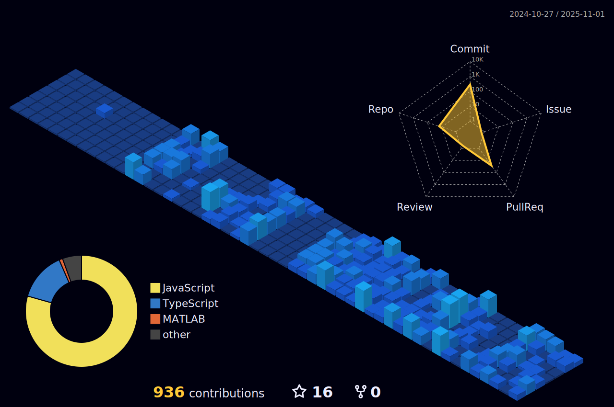
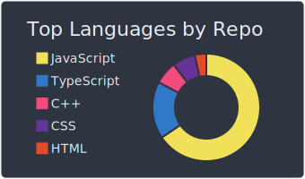
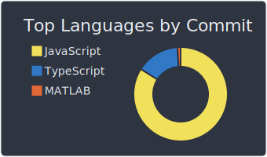
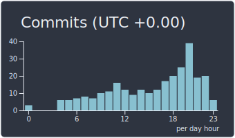

<!-- ================ HEADER ================ -->
# Hey, I'm Pranaw Kumar! 👋 

  

 

  

  
  
  

---

## 🌟 About Me

- 🎓 **EE Undergrad** @ NIT Jamshedpur (Batch of ’28)
- 🤖 Currently diving deep into **Backend Engineering** and **Competitive Programming**
- 💡 Passionate about building efficient and scalable **web applications**, exploring intelligent **AI integrations**, and excelling in **algorithmic problem solving & system design**
- 📬 Reach me at: **pranaw.kr.dev@gmail.com**

---
## 🚀 Technologies I've Worked With

### 💻 Languages

### 🧱 Libraries & Frameworks

### 🗄️ Databases & ORMs

### ☁️ Cloud & DevOps

### 🧰 Tools & IDEs

### 🌐 Markup & Core Stack

### 🖥️ OS & Shell

 

# Github stats

  
  
  

 

> "do or do!" 
